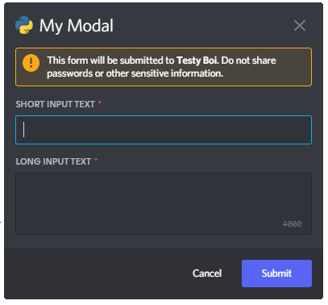
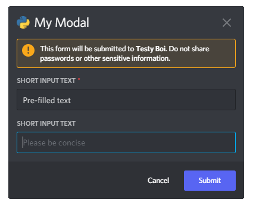

# Modals

As everyone knows from surfing on the web, popups are really great. Everyone loves them and they make for a great UX.
Luckily for you, you have the option to regale your user's love for them by using modals.

Modals are made of modular *(hah)* components, similar to `ActionRow` from the last Chapter.
Importantly, both modals themselves and modal components also have a `custom_id` which you can supply.
If you want to do anything with the data the users input, it is ***highly*** recommended that you set a `custom_id` for your components.

You cannot not use the same components you can use in `ActionRow` for modals.

## Making Modular Modals

Modals are one of the ways you can respond to interactions with. They are intended for when you need to query a lot of information from a user.

Modals are valid responses to Slash Commands and Components.
You **cannot** respond to a modal with a modal.
Use `ctx.send_modal()` to send a modal.

```python
@slash_command(name="my_modal_command", description="Playing with Modals")
async def my_command_function(ctx: InteractionContext):
    my_modal = Modal(
        title="My Modal",
        components=[
            ShortText(label="Short Input Text", custom_id="short_text"),
            ParagraphText(label="Long Input Text", custom_id="long_text"),
        ],
    )
    await ctx.send_modal(modal=my_modal)
    ...
```

This example leads to the following modal:
    <br>

## Reading Responses

Okay now the users can input and submit information, but we cannot view their response yet.
To wait for a user to fill out a modal and then get the data, use `bot.wait_for_modal(my_modal)`.

As with `bot.wait_for_component()`, `bot.wait_for_modal()` supports timeouts. Checks are not supported, since modals are not persistent like Components, and only visible to the Interaction invoker.

```python
...
modal_ctx: ModalContext = await ctx.bot.wait_for_modal(my_modal)
await ctx.send(f"""You input {modal_ctx.responses["short_text"]} and {modal_ctx.responses["long_text"]}""")
```

`bot.wait_for_modal()` returns `ModalContext` which, to nobodies surprise, you need to respond to as well. Respond to it by utilising `modal_ctx.send()`, as you are probably already used to.

To get the data the user input, you can use `modal_ctx.responses`. This returns a dictionary with the `custom_id` you set for your components as keys, and the user inputs as values.
As previously mentioned, you really want to set your own `custom_id` because otherwise you will have problems figuring out to which component what input belongs.  

## Customising Components

Modal components are customisable in their appearance. You can set a placeholder, pre-fill them, restrict what users can input, or make them optional.

```python
@slash_command(name="my_modal_command", description="Playing with Modals")
async def my_command_function(ctx: InteractionContext):
        my_modal = Modal(
        title="My Modal",
        components=[
            ShortText(
                label="Short Input Text",
                custom_id="short_text",
                value="Pre-filled text",
                min_length=10,
            ),
            ShortText(
                label="Short Input Text",
                custom_id="optional_short_text",
                required=False,
                placeholder="Please be concise",
                max_length=10,
            ),
        ],
    )
    await ctx.send_modal(modal=my_modal)
    ...
```

This example leads to the following modal:
    <br>
