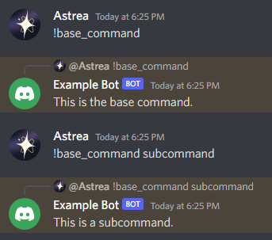
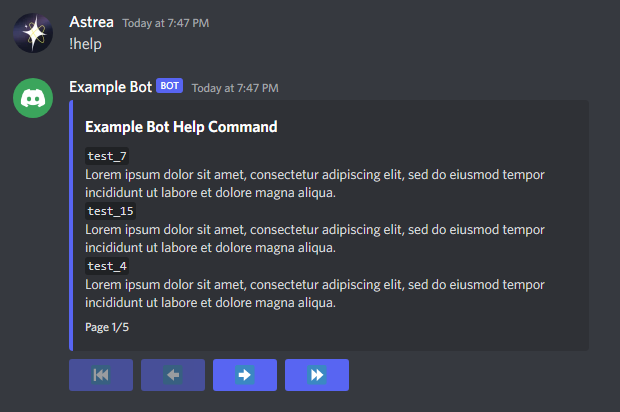

# Creating Prefixed Commands

Prefixed commands, called by Discord as "text commands" and sometimes called "message commands" (not to be confused with Context Menu Message Commands), are commands that are triggered when a user sends a normal message with a designated "prefix" in front of them.

??? note "Naming"
    While Discord themselves has used "text commands" to refer to these, we disagree with this naming. We think it is confusing, especially when referring to how Discord refers to slash commands (chat input commands). Thus, this library will use "prefixed commands", both in code and for its documentation.

While slash commands have been released, and is typically the way you should be making commands these days, there are many cases where the "legacy" commands may want to be kept due to various reasons, like wanting to use types not well-supported by Discord or to allow for greater flexibility for permission handling.

Whatever the reason is, `NAFF` has an extensive yet familiar prefixed command architecture ready to be used.

## Your First Prefixed Command

To create a prefixed command, simply define an asynchronous function and use the `@prefixed_command()` decorator above it.

```python
@prefixed_command(name="my_command")
async def my_command_function(ctx: PrefixedContext):
    await ctx.reply("Hello world!")
```

??? note "Command Name"
    If `name` is not specified, `NAFF` will automatically use the function's name as the command's name.

If the bot's prefix was set to `!`, then a user could invoke it like so:


## Subcommands

Subcommands are rather simple, too:

```python
@prefixed_command()
async def base_command(ctx: PrefixedContext):
    await ctx.reply("This is the base command.")

@base_command.subcommand()
async def subcommand(ctx: PrefixedContext):
    await ctx.reply("This is a subcommand.")
```

A user can use them like so:



## Parameters

Often, when using prefixed commands, you typically want to parse in what the user says into seperated parameters/arguments. This can be done easily in this library using a Python-esque syntax.

For example, to make a command that takes in one argument, we can do:
```python
@prefixed_command()
async def test(ctx: PrefixedContext, arg):
    await ctx.reply(arg)
```

When a user uses the command, all they simply need to do is pass a word after the command:


If the user wishes to use multiple words in an argument like this, they can wrap it in quotes like so:


!!! warning "Forgetting Quotes"
    If a user forgets or simply does not wrap multiple words in an argument in quotes, the library will only use the first word for the argument and ignore the rest.

    

You can add as many parameters as you want to a command:
```python
@prefixed_command()
async def test(ctx: PrefixedContext, arg1, arg2):
    await ctx.reply(f"Arguments: {arg1}, {arg2}.")
```


### Variable and Keyword-Only Arguments

There may be times where you wish for an argument to be able to have multiple words without wrapping them in quotes. There are two ways of apporaching this.

#### Variable

If you wish to get a list (or more specifically, a tuple) of words for one argument, or simply want an undetermined amount of arguments for a command, then you should use a *variable* argument:
```python
@prefixed_command()
async def test(ctx: PrefixedContext, *args):
    await ctx.reply(f"{len(args)} arguments: {', '.join(args)}")
```

The result looks something like this:


Notice how the quoted words are still parsed as one argument in the tuple.

#### Keyword-Only

If you simply wish to take in the rest of the user's input as an argument, you can use a keyword-only argument, like so:
```python
@prefixed_command()
async def test(ctx: PrefixedContext, *, arg):
    await ctx.reply(arg)
```

The result looks like this:


??? note "Quotes"
    If a user passes quotes into a keyword-only argument, then the resulting argument will have said quotes.

    

!!! warning "Parser ambiguities"
    Due to parser ambiguities, you can *only* have either a single variable or keyword-only/consume rest argument.

## Typehinting and Converters

### Basic Types

Parameters, by default, are assumed to be strings, since `Message.content`, the content used for prefixed commands, is one. However, there are many times where you want to have a parameter be a more specific type, like a integer or boolean.

`NAFF` provides an easy syntax to do so:

```python
@prefixed_command()
async def test(ctx: PrefixedContext, an_int: int, a_float: float):
    await ctx.reply(str(an_int + a_float))
```


Words/arguments will automatically be converted to the specified type. If `NAFF` is unable to convert it (a user could easily pass a letter into `an_int`), then it will raise a `BadArgument` error, which can be handled by an error handler. Error handling is handled similarily to how it is handled with [slash commands](/Guides/03 Creating Commands).

You can even pass in a function for parameters:

```python
def to_upper(arg: str):
    return arg.upper()

@prefixed_command()
async def test(ctx: PrefixedContext, uppered: to_upper):
    await ctx.reply(uppered)
```


??? note "Functions"
    If functions are used as arguments, they can either have one parameter (which is the passed argument as a string) or two parameters (which are the context and the argument).
    They can also be asynchronous or synchronous.
    Also, your typechecker will likely complain about this. You can ignore it for `NAFF`.

#### Booleans

Booleans, unlike other basic types, are handled somewhat differently, as using the default `bool` converter would make any non-empty argument `True`. It is instead evaluated as so:

```python
if lowered in {"yes", "y", "true", "t", "1", "enable", "on"}:
    return True
elif lowered in {"no", "n", "false", "f", "0", "disable", "off"}:
    return False
```

### Converters

Converters work much of the same way as they do for other commands; see [the guide for converters for reference](/Guides/08 Converters).

There are a few specific converters that only work with prefixed commands due to their nature, however.

#### Discord Converters

Prefixed commands can be typehinted with some Discord models, like so:

```python
@prefixed_command()
async def poke(ctx: PrefixedContext, target: Member):
    await ctx.reply(f"{target.mention}, you got poked by {ctx.author.mention}!")
```

The argument here will automatically be converted into a `Member` object:


A table of supported objects and their converters can be found [here](/Guides/08 Converters#discord-model-converters). You may use the Discord model itself in your command for prefixed commands, just like the above, and their respective converter will be used under the hood.

#### `typing.Union`

`typing.Union` allows for a parameter/argument to be of multiple types instead of one. `NAFF` will attempt to convert a given argument into each type specified (starting from the first one), going down the "list" until a valid match is found.

For example, the below will try to convert an argument to a `GuildText` first, then a `User` if it cannot do so.

```python
@prefixed_command()
async def union(ctx: PrefixedContext, param: Union[GuildText, User]):
    await ctx.reply(str(param))
```


#### `typing.Optional`

Usually, `Optional[OBJECT]` is an alias for `Union[OBJECT, None]` - it indicates the parameter can be passed `None` or an instance of the object itself. It means something slightly different here, however.

If a parameter is marked as `Optional`, then the command handler will try converting it to the type inside of it, defaulting to either `None` or a default value, if found. A similar behavior is done is the value has a default value, regardless of if it is marked with `Optional` or not.

For example, you could use the following code:

```python
@prefixed_command()
async def ban(ctx: PrefixedContext, member: Member, delete_message_days: Optional[int] = 0, *, reason: str):
    await member.ban(delete_message_days=delete_message_days, reason=reason)
    await ctx.reply(f"Banned {member.mention} for {reason}. Deleted {delete_message_days} days of their messages.")
```

And if a user omits the `delete_message_days` parameter, it would act as so:


#### `typing.Literal`

`typing.Literal` specifies that a parameter *must* be one of the values in the list. `NAFF` also forces that here (though this only works with values of basic types, like `str` or `int`):

```python
@prefixed_command()
async def one_or_two(ctx: PrefixedContext, num: Literal[1, 2]):
    await ctx.reply(str(num))
```


#### `typing.Annotated`

Using `typing.Annotated` can allow you to have more proper typehints when using converters:

```python
class JudgementConverter(Converter):
    async def convert(self, ctx: PrefixedContext, argument: str):
        return f"{ctx.author.mention} is {argument}."

@prefixed_command()
async def judgement(ctx: PrefixedContext, judgment: Annotated[str, JudgementConverter]):
    await ctx.reply(judgment)
```

`NAFF` will use the second parameter in `Annotated` as the actual converter.

#### `Greedy`

The `Greedy` class, included in this library, specifies `NAFF` to keep converting as many arguments as it can until it fails to do so. For example:

```python
@prefixed_command()
async def slap(ctx: PrefixedContext, members: Greedy[Member]):
    slapped = ", ".join(x.display_name for x in members)
    await ctx.reply(f"{slapped} just got slapped!")
```


!!! warning "Greedy Warnings"
    `Greedy` does *not* default to being optional. You *must* specify that it is by giving it a default value or wrapping it with `Optional`.
    `Greedy`, `str`, `None`, `Optional` are also not allowed as parameters in `Greedy`.
    `Greedy` cannot be used as a variable or keyword-only argument.

## Help Command

There is no automatically added help command in `NAFF`. However, you can use `PrefixedHelpCommand` to create one with ease. Using it looks like so:

```python
from naff.ext.prefixed_help import PrefixedHelpCommand

# There are a variety of options - adjust them to your liking!
help_cmd = PrefixedHelpCommand(bot, ...)
help_cmd.register()
```

With the default options, the result looks like:



## Other Notes
- Checks, cooldowns, and concurrency all works as-is with prefixed commands.
- Prefixed commands uses a different method to process `Converter`s compared to slash commands. While they should roughly give the same result, they may act slightly differently.
- All prefixed commands use `PrefixedContext`, which contains useful information based on the current instance of the command.
